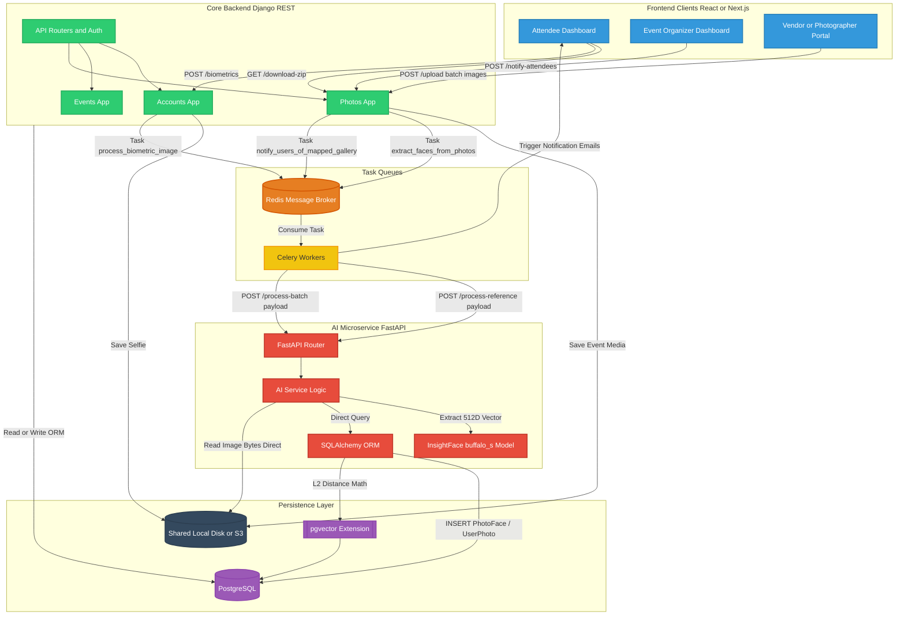

# Neoevents Full Architectural Diagram

Below is the complete, high-definition architectural map of the Neoevents Platform. This diagram illustrates the physical infrastructure, network layers, application services, and data persistence layers.

### Component Legend
* **Blue (Clients)**: The user-facing interfaces where Attendee, Vendors, and Organizers interact with the system.
* **Green (Django)**: The primary REST API. Handles permissions, session tokens, and business logic.
* **Orange/Yellow (Task Queues)**: The Celery and Redis stack that offloads heavy lifting from Django so the user doesn't experience hanging requests.
* **Red (FastAPI)**: The dedicated, isolated Python microservice that strictly handles InsightFace detection and vector math.
* **Purple/Dark Blue (Persistence)**: The hard storage. The PostgreSQL database (enhanced with `pgvector`) and the physical file storage where the heavy `.jpg` files live.
