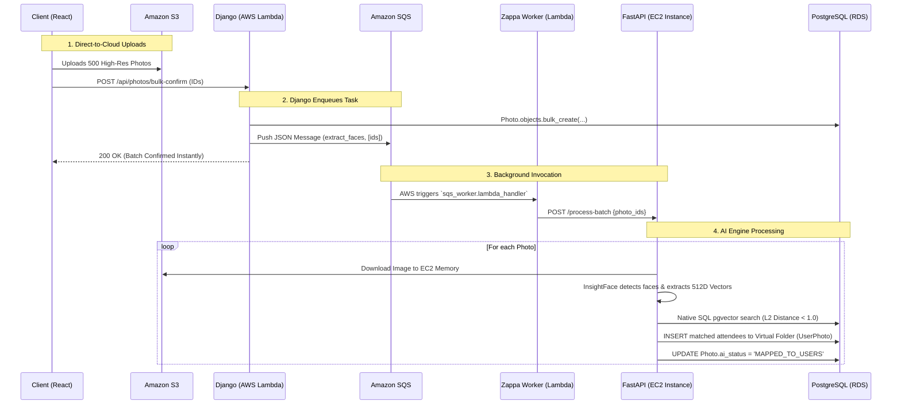

# Infrastructure Flow: Django + SQS + FastAPI

This document details exactly how the Django Orchestrator, Amazon SQS, and the FastAPI AI Engine work together in the production architecture.

## The Big Picture
The goal of this architecture is to keep the Django API (hosted on AWS Lambda) lightning-fast and entirely decoupled from the heavy GPU/CPU compute required by facial recognition. 

By using **Amazon SQS** as the middleman, Django can instantly offload work, and the **FastAPI EC2 instance** processes tasks at its own pace without crashing or causing HTTP timeouts.

---

## Step-by-Step Flow

### 1. Direct-to-Cloud Uploads
Because AWS Lambda has a strict 6MB payload limit, photos are never uploaded *through* Django. The frontend React app requests pre-signed URLs from Django, uploads the heavy files directly to **Amazon S3**, and then sends Django a lightweight JSON array of the successful S3 object keys.

### 2. The Orchestrator (Django on AWS Lambda)
When Django receives the confirmation array, it instantly writes the database records marking the photos as `PENDING`. Instead of doing the heavy lifting, Django fires off a message to **Amazon SQS** (Simple Queue Service) containing the `photo_ids` and the `event_id`, and immediately returns a `200 OK` to the frontend.

### 3. The Queue (Amazon SQS + Zappa Worker)
Amazon SQS acts as a durable waiting room. The `zappa_settings.json` file is configured so that whenever a message enters the SQS queue, AWS automatically spins up a background Lambda worker (`sqs_worker.lambda_handler`) to consume it. This isolates the background task completely from the web traffic Lambda.

### 4. The AI Engine (FastAPI on EC2)
The background Lambda worker takes the SQS payload and makes a standard HTTP POST request to your **EC2 instance** running the FastAPI service. 
FastAPI is the heavy lifter. It:
1. Downloads the specific image from S3 into memory.
2. Runs the hardware-accelerated **InsightFace** model to find human faces and extract mathematical 512-Dimensional vectors.
3. Connects directly to the PostgreSQL database.
4. Uses the **pgvector** C-extension to run an incredibly fast mathematical search (`L2 Distance`) to match the new face vectors against all registered attendees for that event.

### 5. Resolution
FastAPI writes the final matches directly to the database (adding the user to the `UserPhoto` virtual folder). It updates the `ai_status` to `MAPPED_TO_USERS`. The next time the attendee refreshes their React app, the newly mapped photos will be waiting in their gallery!
