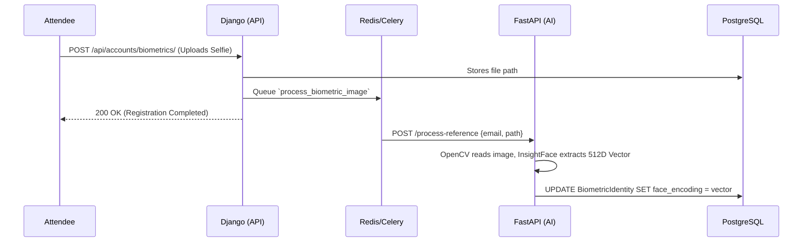
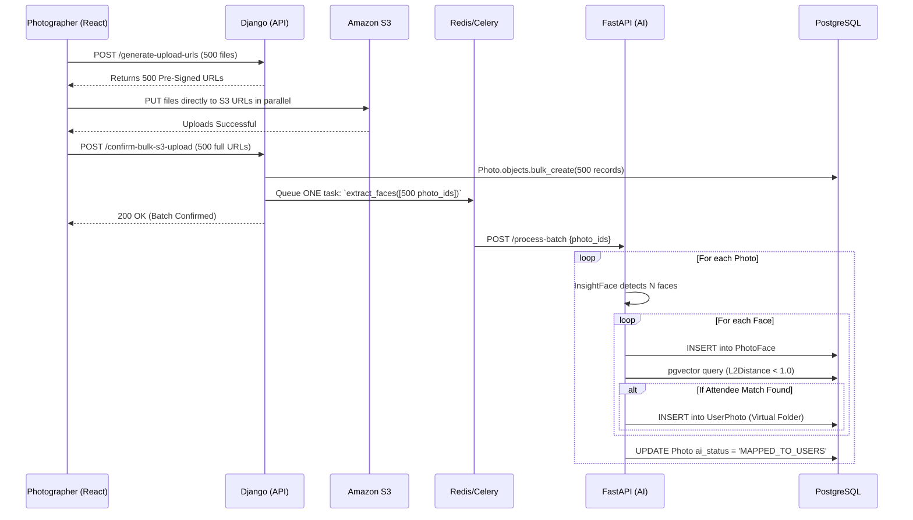
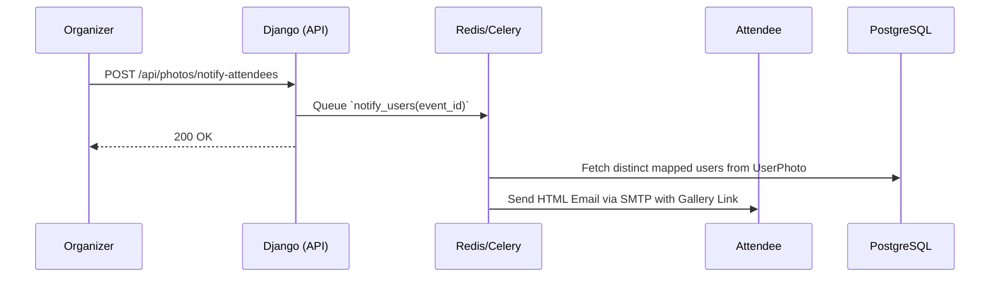

# Neoevents Platform: Comprehensive Product Requirements & Technical Implementation Document (PRD)

## 1. Executive Summary

### 1.1 Project Vision
Neoevents is a next-generation, AI-powered event management and media distribution platform. Historically, event photography distribution relies on manual sorting or sending attendees thousands of unsorted images via Google Drive or Dropbox. Neoevents solves this by leveraging advanced facial recognition (InsightFace) and high-performance vector databases (pgvector) to instantly and automatically map bulk-uploaded event photos to individual attendees.

### 1.2 Core Objectives
- **Zero-Friction Distribution**: Deliver personalized "Virtual Folders" to attendees automatically.
- **Biometric Precision**: Achieve >99% accuracy in facial mapping under diverse lighting and crowd conditions.
- **Infinite Scalability**: Utilize a decoupled microservice architecture ensuring the heavy AI computational load never slows down the primary web application.
- **Cost-Effective Infrastructure**: Run highly intensive operations securely on a minimal, single-node cloud architecture with persistent block storage.

---

## 2. User Personas & Permissions

The platform enforces strict Role-Based Access Control (RBAC).

### 2.1 System Administrator (Superuser)
- Complete oversight of the platform.
- Can manage all users, ban accounts, view global analytics, and access the Django Admin portal.

### 2.2 Event Organizer (The Client)
- **Event Lifecycle Management**: Creates events, sets dates/locations, and manages attendee guestlists.
- **Vendor Orchestration**: Invites vendors (caterers, decorators) and specific Photographers/Videographers to the event.
- **Gatekeeper Authority**: The sole authority who can trigger the `Notify Attendees` API. They review the AI-mapped gallery and initiate the final email broadcast.

### 2.3 Photographer / Videographer
- **Media Upload**: Can bulk-upload hundreds of high-resolution images to the official event gallery.
- **Restricted Access**: Cannot see other photographers' raw uploads, cannot access attendee PII (Personally Identifiable Information), and cannot trigger notification blasts.

### 2.4 General Vendor (e.g., Caterer, Decorator)
- **Portfolio Management**: Uploads specific galleries to showcase their branding and services at an event for publicity purposes. Does not trigger AI facial mapping.

### 2.5 Attendee (The End User)
- **Biometric Onboarding**: Uploads a single "reference selfie" during registration to establish their digital identity.
- **Gallery Consumption**: Receives an email notification when the gallery is ready, clicks a magic link, and downloads a personalized `.zip` containing only the photos they appear in.

---

## 3. Functional Requirements

### 3.1 Authentication & Authorization
- **JWT Authentication**: Stateless token-based authentication via `djangorestframework-simplejwt`.
- **Role Enforcement**: Custom permission classes (`IsEventOwnerRole`, `IsVendorRole`, `IsAttendeeRole`) applied at the view level.

### 3.2 Biometric Identity Management
- Attendees upload a clear selfie. The system validates the image quality (detects exactly one face) and extracts a 512-Dimensional facial vector, storing it securely. Original selfies are discarded or secured to maintain GDPR compliance.

### 3.3 Media Upload & Processing
- **Direct-to-S3 Bulk Upload**: Vendors upload images directly to Amazon S3 bypassing the backend server completely.
- The frontend requests an array of pre-signed S3 URLs from Django, uploads to S3 in parallel, and then hits a bulk confirmation webhook to instantly write thousands of records via `bulk_create` without timeouts.

### 3.4 AI Facial Mapping Engine
- The AI Engine must read the uploaded image, detect all human faces (bounding boxes), extract 512D vectors for each face, and perform a mathematical `L2 Distance` similarity search against all registered attendees for that event.
- Threshold for a positive match: `L2 Distance < 1.0` (configurable based on testing).

---

## 4. Non-Functional Requirements

- **Performance**: The Django API must respond to standard queries in < 200ms. AI Processing should process ~5-10 images per second per worker.
- **Scalability**: The architecture must support decoupling so that during high-load periods (e.g., Saturday night weddings), Celery workers and FastAPI instances can be scaled horizontally without affecting the web API.
- **Availability**: High availability achieved through containerization and automatic restart policies via Docker Compose.
- **Security**: All API traffic encrypted via HTTPS/TLS 1.2+. Passwords hashed using PBKDF2. Vector data is anonymized and un-reverse-engineerable into physical images.

---

## 5. System Architecture & Microservices

The architecture uses a strictly decoupled, microservice pattern to isolate the heavy computational load of Artificial Intelligence from the primary user-facing API.

### 5.1 The Orchestrator: Django Monolith
- **Framework**: Django REST Framework (Python 3.10).
- **Responsibilities**: Authentication, API routing, Database ORM, Permissions, and orchestrating Celery task queues.

### 5.2 The AI Engine: FastAPI Microservice
- **Framework**: FastAPI (Python 3.10) running on Uvicorn.
- **Responsibilities**: Image processing, facial detection, and vector mathematics.
- **Technology**: Utilizes `InsightFace` (buffalo_s) using OpenCV (`cv2`) for blazing-fast hardware-accelerated image parsing.

### 5.3 Background Processing: Celery & Redis
- **Message Broker**: Redis serves as the in-memory queue.
- **Workers**: Celery workers pick up tasks (like sending emails or batching photo IDs) and make internal HTTP calls to the FastAPI microservice.

### 5.4 Persistence Layer: PostgreSQL + pgvector
- **PostgreSQL**: The single source of truth.
- **pgvector**: A C-based extension enabling ultra-fast `L2 Distance` similarity searches across 512D vectors directly inside the SQL engine.

### 5.5 Object Storage: Amazon S3
- All raw images and user profile pictures are stored in AWS S3, providing infinite scaling.

---

## 6. Implementation Workflows (Sequence Diagrams)

### 6.1 Biometric Registration Flow


### 6.2 AI Batch Upload & Mapping Flow (Direct-to-S3)


### 6.3 Notification Flow


---

## 7. Database Strategy: "Logical Partitioning"

To prevent exponential storage costs, images are never copied or moved into physical user folders. We use **Logical Partitioning**.

### 7.1 The Models
- **`Photo`**: The physical file reference (e.g., `s3://bucket/event1/img1.jpg`).
- **`PhotoFace`**: The raw AI extraction (the bounding box and 512D vector of a specific face in a photo).
- **`UserPhoto` (The Virtual Folder)**: A junction table linking a `user_id` directly to a `photo_id`. 

### 7.2 The Virtual Folder Query
When Attendee "John" views their gallery, the system executes an instantaneous JOIN:
```sql
SELECT photo.*
FROM photos_photo p
JOIN photos_userphoto up ON up.photo_id = p.id
WHERE up.user_id = 'John_ID';
```

---

## 8. Cloud DevOps & CI/CD Infrastructure

The platform is designed to run securely and cheaply using **Infrastructure as Code (Terraform)**.

### 8.1 Backend Infrastructure (Lambda / EC2 Hybrid Support)
- **AWS Lambda Ready**: Because massive file uploads bypass the server (Direct-to-S3), the Django REST API never hits Lambda's 6MB payload limit. The backend is 100% capable of deploying to AWS Lambda (using Zappa/Mangum) for a scale-to-zero, ultra-cheap architecture.
- **Current Single-Node AWS EC2**: Alternatively, the current deployment utilizes a single AWS `t3.medium` EC2 Instance.
- **Containerization**: Everything (Django, FastAPI, Celery, Redis, Postgres DB) runs inside standard Docker containers orchestrated via `docker-compose.prod.yml`.
- **Data Safety**: A dedicated Docker volume mounts the Postgres database directly to the EC2 root EBS volume to prevent data loss.

### 8.2 Frontend Infrastructure (AWS S3 + CloudFront)
- **Storage**: The compiled React SPA is hosted in an Amazon S3 Website Bucket.
- **CDN**: Amazon CloudFront globally caches the frontend, managing HTTPS certificates and routing all traffic blazingly fast.

### 8.3 CI/CD Pipelines (GitHub Actions)
- **Backend Deployment**: On push to `main`, GitHub Actions SSHs into the EC2 instance, pulls the latest code, and runs `docker-compose up -d --build` for zero-downtime hot swapping.
- **Frontend Deployment**: Compiles the React application via `npm run build`, pushes the assets via `aws s3 sync`, and triggers an `aws cloudfront create-invalidation` to update users worldwide instantly.
