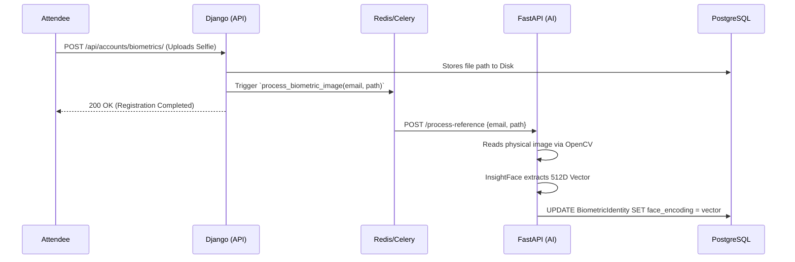
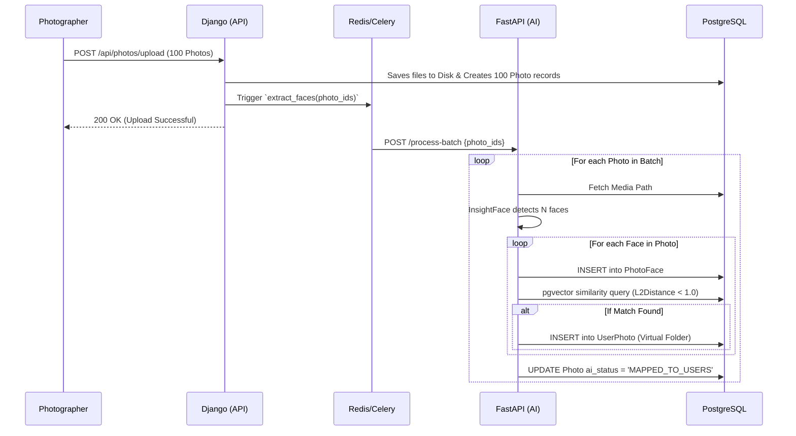
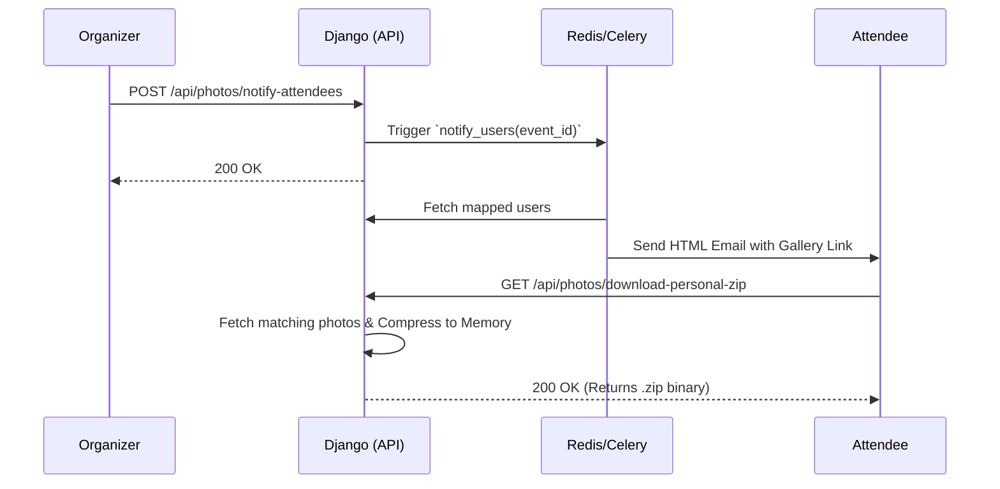

# Neoevents Platform: Product Requirements & Technical Implementation Bible

## 1. Executive Summary
Neoevents is a scalable, AI-powered event management platform designed to automate the delivery of event photography. By leveraging advanced facial recognition (InsightFace) and high-performance vector databases (PostgreSQL + pgvector), the system allows photographers to bulk-upload images while instantly delivering personalized "Virtual Folders" to attendees, eliminating the manual effort of searching through thousands of event photos.

## 2. User Roles & Capabilities

### 2.1 Event Organizers
The administrative owners of an event.
- **Event Creation**: Organizers can create and manage events.
- **Vendor Management**: Organizers can invite specific photographers/videographers to their events.
- **Administrative Control**: They maintain full control over the official event gallery.
- **Action (Broadcast)**: The Organizer is the sole authority who can trigger the `Notify Attendees` API. Once all media is mapped, they initiate the email blast that delivers the personal galleries to the guests.

### 2.2 Vendors & Photographers
Professional service providers on the platform.
- **General Vendors**: Caterers, decorators, etc., who upload galleries to showcase their portfolio.
- **Event Photographers**: When invited to an event by an Organizer, photographers gain the ability to upload high-resolution media in massive batches directly to the official event gallery.

### 2.3 Attendees
Guests attending the event.
- **Biometric Onboarding**: During registration, attendees upload a reference selfie. The system extracts a 512-Dimensional facial vector from this selfie to establish their biometric identity.
- **Personalized Delivery**: Attendees receive an automated email when their photos are ready. They can log into the portal and download a dynamically generated `.zip` file containing only the photos they appear in.

---

## 3. System Architecture & Component Interactions

The architecture uses a decoupled, microservice pattern to isolate the heavy computational load of Artificial Intelligence from the primary user-facing API.

### 3.1 The Django Monolith (Primary API)
- **Framework**: Django REST Framework.
- **Responsibilities**: Authentication, Authorization, Database ORM, File Storage orchestration, and API endpoints.
- **Background Tasks**: Uses Celery + Redis to offload heavy API triggers so the frontend never experiences hanging requests.

### 3.2 The FastAPI Engine (AI Microservice)
- **Framework**: FastAPI (Python).
- **Responsibilities**: Solely dedicated to image processing, facial detection, and vector mathematics.
- **Technology**: Utilizes `InsightFace` (buffalo_s) for 512D vector extraction and `SQLAlchemy` for direct database integration.

### 3.3 Persistence Layer
- **PostgreSQL**: The single source of truth for both Django and FastAPI.
- **pgvector**: A PostgreSQL extension enabling ultra-fast `L2 Distance` similarity searches across 512D vectors natively in SQL.
- **Shared File System**: Images uploaded via Django are stored on a shared disk. FastAPI reads these images directly from the disk using OpenCV, bypassing HTTP network transfers entirely.

---

## 4. Sequence Diagrams (Technical Workflows)

### 4.1 Biometric Registration Flow
How an attendee establishes their digital identity.

### 4.2 Batch Upload & AI Mapping Flow
How photographer uploads are processed efficiently without crashing the server.

### 4.3 Notification & Delivery Flow
How organizers broadcast the galleries and attendees download them.

---

## 5. Database Schema & Data Strategy

### 5.1 The "Virtual Folder" Architecture
To prevent exponential storage duplication, images are never copied. Instead, they are referenced relationally.
- `Photo`: Represents the physical `.jpg` file uploaded by the vendor.
- `PhotoFace`: Represents the bounding box coordinates and 512D embedding of a specific face inside the `Photo`.
- `UserPhoto`: The relational bridge. If a Photo contains Face A (mapped to Attendee A) and Face B (mapped to Attendee B), the system inserts two lightweight records into `UserPhoto`. When Attendee A views their gallery, Django simply queries `UserPhoto` for their matches.

### 5.2 Core Models
- `accounts_biometricidentity`: Stores the `user_id`, `email`, and the `face_encoding` (512D Vector).
- `photos_photo`: Stores the `event_id`, `uploader`, `media_file` path, and `ai_status` (PENDING, FACES_DETECTED, MAPPED).
- `photos_photoface`: Stores the `photo_id`, `face_embedding`, and `bounding_box`.
- `photos_userphoto`: Stores the `user_id`, `photo_id`, and `event_id`. Enforces a `unique_together` constraint to prevent duplicate mapping.
