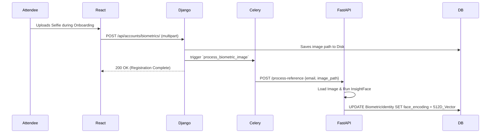
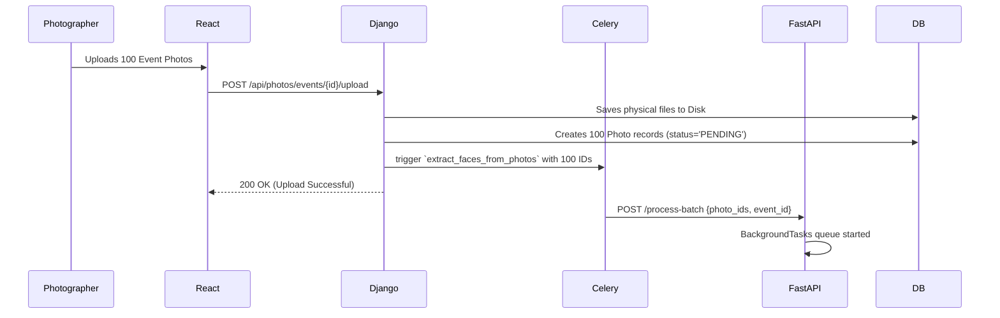
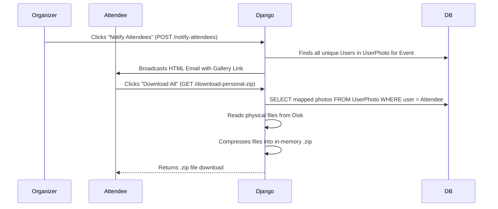

# Neoevents System Architecture: The Master "Bible"

This document serves as the absolute master guide for the Neoevents platform. It covers the full module-by-module breakdown, user-type functionalities, step-by-step implementation workflows, and the exact architectural connections between the Frontend (React), the Main Backend (Django), and the AI Microservice (FastAPI).

---

## 1. High-Level Architecture
The Neoevents ecosystem is built on a highly decoupled, microservice-inspired architecture designed to handle massive computational loads (like processing thousands of high-resolution images through Deep Learning models) without blocking the main user API.

```mermaid
graph TD
    Client[Frontend: React/Next.js UI]
    Django[Main Backend: Django REST Framework]
    Celery[Task Queue: Celery]
    Redis[(Message Broker: Redis)]
    FastAPI[AI Engine: FastAPI]
    DB[(Database: PostgreSQL + pgvector)]
    Storage[File Storage: Local Disk / S3]

    Client <-->|REST API (JSON/Multipart)| Django
    Django -->|Writes Images| Storage
    Django -->|Reads/Writes Data| DB
    Django -->|Enqueues Tasks| Celery
    Celery -->|Pulls Tasks| Redis
    Celery -->|HTTP JSON Payload| FastAPI
    FastAPI -->|Reads Images directly| Storage
    FastAPI -->|Native SQL & Vector Math| DB
```

### Module Breakdown
* **Frontend (React)**: The presentation layer. It provides tailored dashboards for Organizers, Vendors, and Attendees. It uploads files via `multipart/form-data` and fetches data via standard `GET` requests.
* **Django (The Orchestrator)**: The central hub. It handles all authentication, permissions, business logic, and standard CRUD operations. It NEVER processes AI logic.
* **Celery & Redis**: The asynchronous bridge. When Django receives a heavy task (like 100 images uploaded), it hands it to Celery so it can immediately return a `200 OK` to the frontend.
* **FastAPI (The AI Engine)**: The heavy lifter. Powered by `InsightFace`, it does one thing perfectly: loads images from disk, extracts 512D facial vectors, calculates L2 Distances, and writes the matches straight into the database via SQLAlchemy.
* **PostgreSQL + pgvector**: The single source of truth. Contains all user data and the mathematical vectors.

---

## 2. User Types & Permissions

### A. Event Organizers
The "Owners" of the event who manage the overarching logistics.
* **Capabilities**: Create Events, invite specific vendors, view complete galleries, and delete unwanted photos.
* **Key Power**: They hold the "Notify Attendees" trigger. Once all media is mapped, they click a button that commands the system to broadcast the personal gallery emails to everyone.

### B. Vendors (General & Photographers)
Independent businesses or freelancers utilizing the platform.
* **General Vendors (e.g., Caterers, Decorators)**: Use the platform to upload past events strictly as a portfolio to showcase their brand.
* **Invited Photographers/Videographers**: When explicitly hired and invited to an event by the Organizer, they gain elevated write-access. They can batch-upload thousands of raw, high-resolution event photos directly to the event's official gallery.

### C. Attendees
The guests attending the event.
* **Capabilities**: Register for events and upload a Reference Selfie.
* **Key Power**: They can log into the portal, view only their personalized virtual folder of matches, and click "Download All" to receive a dynamically generated `.zip` of their memories.

---

## 3. Step-by-Step Implementation Workflows

### Flow 1: Biometric Registration (The Attendee Journey)
How an attendee registers their face with the system.



### Flow 2: Event Photography & Batching (The Photographer Journey)
How a photographer dumps thousands of photos without crashing the server.



### Flow 3: AI Vector Mapping (The Magic inside FastAPI)
This happens instantly in the background for every photo in the batch.

1. **Load**: FastAPI pulls the physical file path from PostgreSQL and loads the image directly from the hard drive via OpenCV (Zero HTTP transfer latency).
2. **Detect**: InsightFace scans the image. It might find 4 distinct faces in a group photo.
3. **Extract & Store**: It extracts a unique 512D mathematical vector for each of the 4 faces and saves them into the `photos_photoface` table.
4. **pgvector Query**: For each face, FastAPI runs a native SQL query:
   ```sql
   SELECT user_id FROM accounts_biometricidentity 
   WHERE face_encoding <-> [current_face_vector] < 1.0 
   ORDER BY distance LIMIT 1;
   ```
5. **Virtual Folders**: If Face 1 matches Attendee A, it inserts a record into `photos_userphoto` mapping Attendee A to the Photo. If Face 2 matches Attendee B, it inserts another record mapping Attendee B to the *same* photo.
6. **Completion**: The photo's `ai_status` updates to `MAPPED_TO_USERS`.

### Flow 4: Delivery & Zipping (The Organizer & Attendee Journey)
How the attendees finally get their photos.



---

## 4. Why This Architecture is Bulletproof
1. **No Out-of-Memory Crashes**: Because Django sends a simple JSON list to FastAPI, FastAPI processes the heavy AI images **sequentially** in a single database session. You can upload 10,000 photos, and RAM usage will remain flat.
2. **Zero Storage Duplication**: The "Virtual Folder" system (`UserPhoto` table) means a 10MB group photo with 5 people in it is only saved on the hard drive *once*. The database simply holds lightweight references linking the 5 users to the 1 file.
3. **Infinite Scalability**: If the AI processing becomes too slow, you can deploy the FastAPI container to a dedicated GPU server on AWS (like a `g4dn.xlarge`), while keeping the cheap Django server running on standard hardware. They communicate effortlessly via HTTP!
